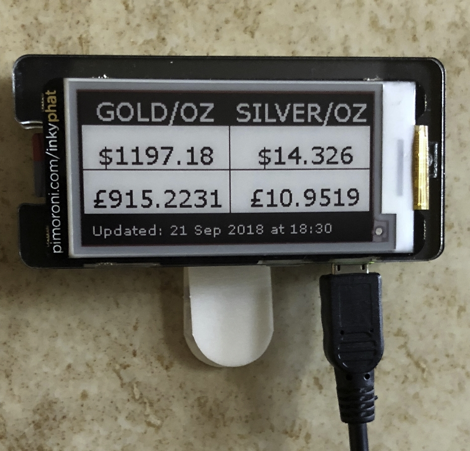

# price_tracker

Simple Raspberry Pi project to display current Gold & Silver prices on an
inky-phat display.
    
## Overview

You will need to sign up with some online resource and get an API key to use.
I used 1forge.com. A free account gets you 1000 calls / day which is more than enough with the polling once every
10 minutes that I used here.

I keep the key in an environment variable so that it doesn't appear anywhere in my uploaded code. The environment
variable is ONEFORGE_SECRET.

I retrieve the current price of gold and silver in USD and GBP and display those 4 pieces of information in a little
table. The last retrieval date and time is shown at the bottom of the screen.

You can change what currency pairs are retrieved. 
Note, though, that if you do. you will need to change the column-headings manually to what you want.

NOTE: I stuck with black & white output. The red ink refresh rate was slower than I wanted.

## Kit & Resources

The font used is from http://www.fontpalace.com/font-download/Verdana/

* Raspberry Pi Zero WH (with wifi)
* inky-phat display that fits over it neatly
* Pi Zero case so the Pi+display can be stuck to a vertical surface somewhere.
    
## Setup

* The raspbian distro runs with Python 2.7 at the time of writing. I think pairs.py will run fine against the latest versions of Python 3.x since a quick test after running through 2to3 only showed the formatting strings were changed to lose the unicode marker.
* install the inky-phat library per the instructions on their github repo at https://github.com/pimoroni/inky-phat
* add a cron job using 'crontab -e', and adding a line like: */10 4-21 * * * python /path/to/price_tracker/pairs.py. This particular one polls the https://1forge.com/forex-data-api site once every 10 minutes between 4 a.m. and 9 p.m.
* get an API key from https://1forge.com/forex-data-api and set an environment variable somewhere that the cron job can pick it up. I used /etc/environment and placed in it an entry like this: export ONEFORGE_SECRET='1234567890ABC'

Here is how the tracker displays prices:

